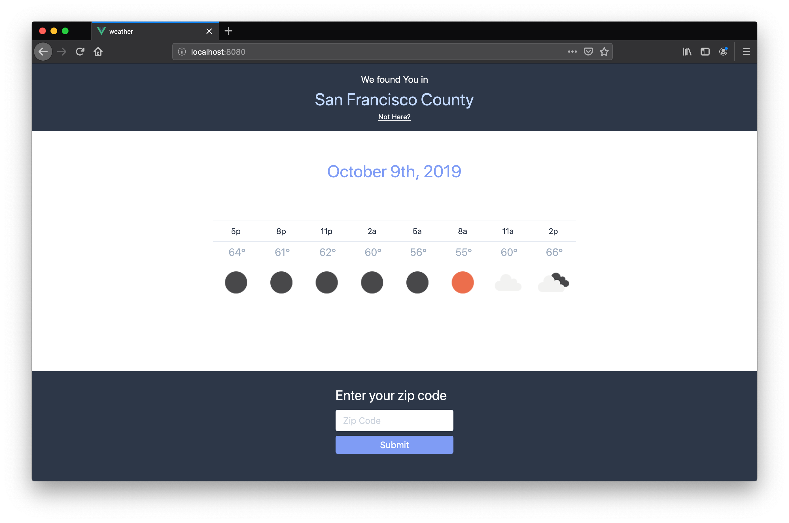

# Weather App

## About

This Weather App is a geolocation enabled responsive web-app that fetches the weather forecast for the next 24 hours in 3 hour windows.

If geolocation is not enabled on your browser, you can enter a us 5 digit zip code to display the weather in the associated area.



## Check it out on CodeSandBox.io

[WeatherApp](https://codesandbox.io/s/vue-template-lpsdq)

## Notes and Limitations

### Your Env

env.js is used to store YOUR Api Key to openweathermap.org.

Use YOUR Api Key not mine.

### Location Display

Due to a limitation of the openweathermap.org, your displayed location does not include your state along with your city. Weird but it's a thing they are working on.

## Notes on Implementation

This app is built on [Vue.js](https://vuejs.org) and uses 'fetch' to get the weather forecast from openweathermap.

It uses [momentjs](https://momentjs.com) for parsing and formatting time.

It uses [tailwind.css](https://tailwindcss.com), a utility first css framework for styling.

## Installation

### Requirements

You must have node and npm installed. You will also need to install Yarn.

For Mac and Unix Environments:
```
curl -o- -L https://yarnpkg.com/install.sh | bash
```

For Windows you can install yarn via npm
```
npm install yarn -g
```

## Install
```
git clone https://github.com/robrogers3/WeatherApp.git

cd WeatherApp

yarn install
```

### Compiles and hot-reloads for development
```
yarn run serve
```

### Compiles and minifies for production
```
yarn run build
```

### Run your tests
```
yarn run test
```

### Lints and fixes files
```
yarn run lint
```

### Customize configuration
See [Configuration Reference](https://cli.vuejs.org/config/).

## About Breaking the Rules

Rules were broken in my selection of Vue and Tailwind.

My original goal was to produce two versions one with frameworks and one without.

With the idea being that show casing the best in class frameworks yields better results in less time.

But I ran out of time.


